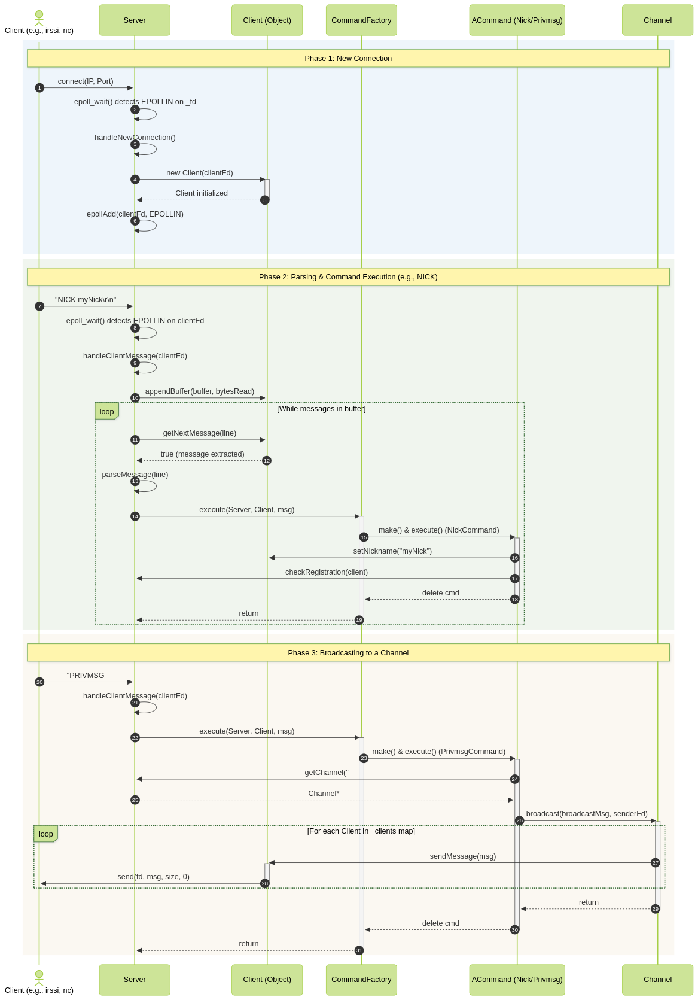
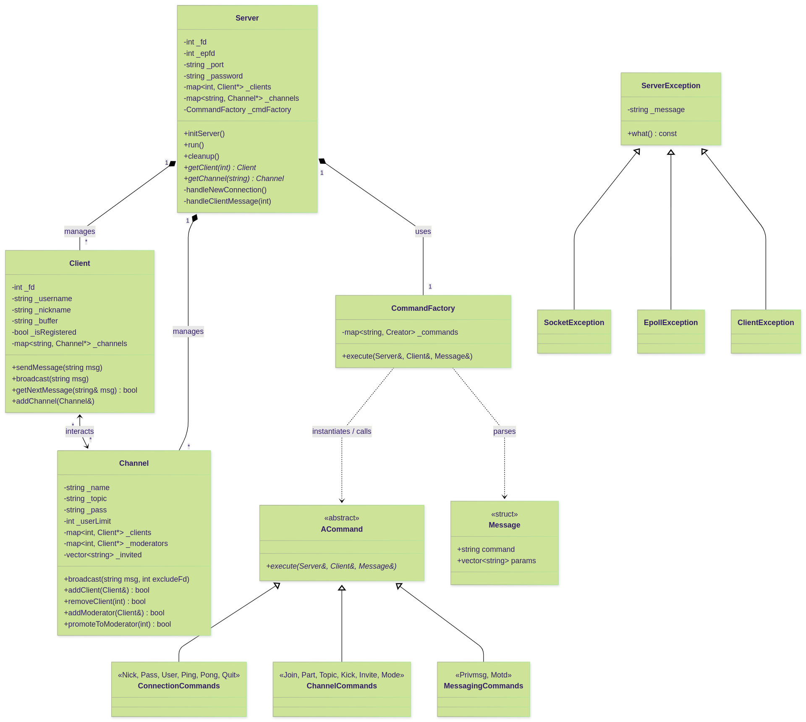

*This project has been created as part of the 42 curriculum by frbranda, rpires-c.*

---

# 📡 ft_irc (Internet Relay Chat Server)

## 📝 Description

This project implements a fully functional Internet Relay Chat (IRC) server in **C++98**.

The server is designed to handle multiple clients concurrently without blocking, using **non-blocking I/O multiplexing (`epoll`)**. It follows the IRC protocol, allowing users to connect via IRC clients (e.g. `nc`, `irssi`), authenticate, and communicate in real time.

### 🚀 Key Features

* **Authentication & Registration**

  * Password verification - `PASS`
  * `NICK` and `USER` handling
  * `PING` and `PONG`
  * `QUIT` (Ctrl + C)

* **Channel Management**

  * Join channels - `JOIN`
  * Leave channels - `PART`
  * Invite to channel - `INVITE`
  * Topic management - `TOPIC`
  * Kick from channel **(Channel Moderator only)** - `KICK`

* **Messaging**

  * Channel broadcasting
  * Private messaging - `PRIVMSG`
  * Message Of The Day - `MOTD`

* **Operator Modes**

  * Invite-only - `+i`
  * Topic lock - `+t`
  * Channel key - `+k`
  * Operator privileges - `+o`
  * User limit - `+l`

---

## ⚙️ Instructions

### ✅ Requirements

* C++ compiler with **C++98 support**
* `make`

---

### 🔨 Build

```sh
make
```

---

### ▶️ Run

```sh
./ircserv <port> <password>
```

### Example

```sh
./ircserv 6667 mypassword123
```

---

## 🛠️ Makefile Rules

```sh
make        # Build the server
make clean  # Remove object files
make fclean # Remove objects + binary
make re     # Rebuild everything
```

### ⚡ Dev Shortcuts

```sh
make r    # Build + run (port 6667, pass 123)
make rv   # Run with valgrind
make rr   # Rebuild + run
make rrv  # Rebuild + run with valgrind
```

---

## 📊 Diagrams

### Base execution flow



### Class Diagram


---

## 📚 Resources

### 📖 IRC Protocol

* [RFC 1459 – Internet Relay Chat Protocol](https://datatracker.ietf.org/doc/html/rfc1459#section-4.2.8)
* [RFC 2812 – Client Protocol](https://www.rfc-editor.org/rfc/rfc2812#section-3.2.3)
* [RFC 2813 – Server Protocol](https://www.rfc-editor.org/rfc/rfc2813)
* [Modern IRC Documents](https://modern.ircdocs.horse/)

### 🌐 Networking

* [Beej's Guide to Network Programming](https://beej.us/guide/bgnet/html/split-wide/)
* [GeeksforGeeks – Socket Programming in C/C++](https://www.geeksforgeeks.org/cpp/socket-programming-in-cpp/)
* [TutorialsPoint – C++ Socket Programming](https://www.tutorialspoint.com/cplusplus/cpp_socket_programming.htm)
* [GeeksforGeeks – Non-blocking I/O with Pipes in C](https://www.geeksforgeeks.org/c/non-blocking-io-with-pipes-in-c/)
* [Cplusplus Forum – Sockets and select/epoll](https://cplusplus.com/forum/unices/10016/)
* [setsockopt – OpenGroup POSIX documentation](https://pubs.opengroup.org/onlinepubs/009695099/functions/setsockopt.html)

### 🧠 Concepts

* [epoll(7) Linux manual page](https://man7.org/linux/man-pages/man7/epoll.7.html) & [epoll_create(2)](https://man7.org/linux/man-pages/man2/epoll_create.2.html)
* [GeeksforGeeks – What is an API?](https://www.geeksforgeeks.org/software-testing/what-is-an-api/)
* [Uptrends – What is IPv4?](https://www.uptrends.com/what-is/ipv4)
* [W3Schools – C++](https://www.w3schools.com/CPP/default.asp)
* [PlantUML – Class Diagrams](https://plantuml.com/class-diagram)

---

## 🤖 AI Usage Statement

Artificial Intelligence (LLMs) was used **strategically** during development:

* **Concept clarification**
  Help understanding `epoll`, `setsockopt`, and non-blocking I/O

* **Architecture visualization**
  Assisted in generating diagrams (Mermaid / structure planning)

* **Debugging assistance**
  Helped interpret strict C++98 compilation issues

* **Formatting & tooling**
  Helped with README formatting

❗ **Important:**
AI was **NOT used** to implement core logic, networking, or business rules **(Domain logic)** of the server.

---
